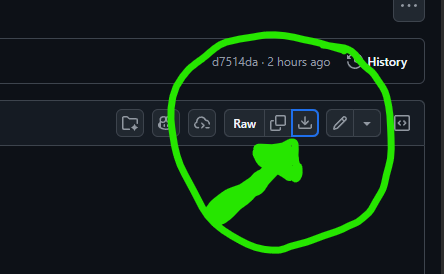

# High-Uncertainty Cognitive Style: A Communication Framework

A practical communication framework for individuals who experience persistent uncertainty when answering questions, and for people who communicate with them.

---

## Download the Framework

**Choose your preferred format:**

| Format | Best For | Link |
|--------|----------|------|
| **Read Online** | Browse on GitHub with working links | [Start Reading (Section 1)](content/section-01-core-cognitive-profile.md) |
| **PDF** | Print, offline reading, sharing | [Download PDF](https://github.com/berad217/simple_questions/raw/master/build/simple-questions-framework.pdf) |
| **HTML** | Browser reading with table of contents | [Download HTML](https://github.com/berad217/simple_questions/raw/master/build/simple-questions-framework.html) |
| **Markdown** | Single compiled file | [View Compiled Markdown](build/simple-questions-framework.md) |
| **Section Files** | Individual chapters as separate files | [Download Zip](https://github.com/berad217/simple_questions/raw/master/build/simple-questions-framework-sections.zip) |

<details>
<summary><strong>Having trouble downloading?</strong></summary>

If you click a link and see code or a preview instead of a download, look for the download button in the upper right:



GitHub's interface is designed for developers, so the download button can be easy to miss.

</details>

---

## What This Is

Some people process questions by simultaneously evaluating multiple dimensions—causal, emotional, moral, strategic, and more. Committing to a single answer feels inaccurate because it "amputates uncertainty."

When asked "Why didn't you call?", they process:
- Logistics (phone was dead, forgot, was busy)
- Relationship implications (does this signal I don't care?)
- Accuracy (which of the 7 contributing factors is THE reason?)
- Future obligations (does answering commit me to a pattern?)
- Meta-level (is this really about the call or something else?)

This isn't overthinking. It's a different cognitive architecture.

**This framework provides:**
- Techniques for asking questions that are easier to answer
- Response formats for giving useful answers without false certainty
- Shared vocabulary for real-time communication repair
- Context-specific protocols for relationships and professional settings

---

## Project Status

**Status**: Content-complete. All sections and appendices are written, cross-reviewed, and consistency-checked.

| Metric | Value |
|--------|-------|
| Sections + appendices | 14 sections + 3 appendices (22 build units) |
| Word count | ~58,700 |
| Build date | 2026-07-21 |

### What's Included

**Part I: Understanding the Pattern**
- Section 1: Core Cognitive Profile
- Section 2: Communication Mismatch

**Part II: Theory & Technique**
- Section 3: Theoretical Frameworks
- Section 4: Question Design Techniques (Core, Advanced, Selection)

**Part III: Protocols**
- Section 5: Response Protocols (for both questioners and responders)
- Section 6: Shared Protocols (negotiation, intent taxonomy, confidence expression)

**Part IV: Applications**
- Section 7: Intimate Relationships
- Section 8: Professional Contexts
- Section 9: Self-Advocacy
- Section 10: Interpretation Guide
- Section 11: Worked Examples

**Part V: Advanced Topics**
- Section 12: Edge Cases & Complications
- Section 13: Cultural & Contextual Factors
- Section 14: Research Connections & Further Reading

**Appendices**
- Appendix A: Quick Reference Cards
- Appendix B: Customization Templates
- Appendix C: Glossary

---

## Quick Start

**If you struggle to answer "simple" questions**: Start with [Section 1](content/section-01-core-cognitive-profile.md) to see if this describes you, then jump to [Section 9: Self-Advocacy](content/section-09-self-advocacy.md).

**If you interact with someone like this**: Start with [Section 2](content/section-02-communication-mismatch.md) to understand the mismatch, then [Section 4.1](content/section-04-1-core-techniques.md) for practical techniques.

**If you want the full picture**: Read in order, or download the PDF.

---

## Core Idea

**Structured dimensionality reduction** through question design and response protocols—NOT asking people to "think simpler."

Instead of: "Why didn't you call?"
Use: "Logistically only—what stopped you from calling yesterday?"

The second question specifies which dimension to answer, making it possible to respond without the paralysis of trying to compress multi-dimensional reality into a single answer.

---

## Philosophy

- **Immediately practical** — techniques usable in the next conversation
- **Non-pathologizing** — this is a cognitive style with trade-offs, not a disorder
- **Dual-perspective** — addresses both questioners and responders
- **Relationship-aware** — communication serves connection, not just information

---

## Project Structure

```
simple_questions/
├── content/           # Individual section files (source of truth)
├── build/             # Compiled outputs (PDF, HTML, etc.)
├── workflow/          # Development infrastructure
├── build.py           # Build script for generating outputs
└── README.md          # This file
```

---

## Building (For Contributors)

The compiled documents are already in `build/`. If you modify section files and need to rebuild:

**Requirements**: Python 3, [Pandoc](https://pandoc.org/), and a PDF engine. This project uses [Tectonic](https://tectonic-typesetting.github.io/) (self-contained—no full LaTeX install needed); any pandoc-supported engine (MiKTeX, TeX Live, etc.) also works.

```bash
python build.py
```

Outputs: PDF, HTML, compiled Markdown, and sections ZIP—all with matching timestamps.

---

## Authors

- Brad (primary author, domain expert)
- Nikki (genesis document)
- Claude (AI writing assistant)

## License

MIT
