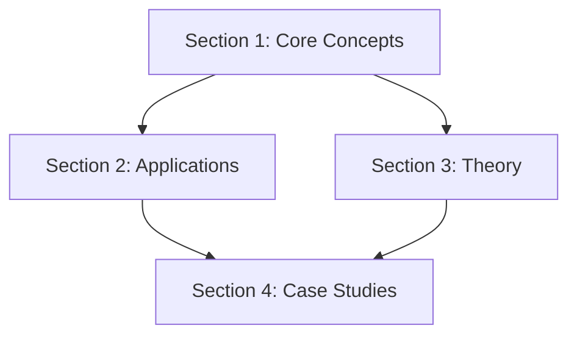

# Workflow Wisdom: AI-Assisted Non-Coding Projects

## Purpose

This document provides a generalizable workflow framework for large-scale non-coding projects developed with AI assistance. Born from a communication framework writing project, these patterns apply to books, research papers, course curricula, technical documentation, policy frameworks, and any structured knowledge work requiring consistency across multiple sessions and tools.

## Who This Is For

- Writers developing books, frameworks, or long-form content with AI
- Researchers organizing complex literature reviews or theoretical frameworks
- Course creators building comprehensive curricula
- Technical writers maintaining large documentation sets
- Policy analysts developing frameworks across multiple domains
- Anyone doing structured knowledge work that spans multiple AI sessions

---

## The Core Challenge

**Problem**: Writing a 100+ page structured document across multiple AI sessions over weeks/months

**Risks**:
- Conceptual drift (same term means different things in different sections)
- Tone drift (voice changes across sessions or AI tools)
- Inconsistent examples (same scenario used differently)
- Lost context (next session doesn't know what previous session decided)
- Dependency confusion (writing Section 5 before Section 2, which it depends on)

**Solution**: Adapt sprint-based development workflow from software projects to writing projects

---

## Key Insight: Treat Writing Like Code

The same problems that plague large codebases without version control and documentation also plague large writing projects:
- How do you maintain consistency?
- How do you track decisions?
- How do you enable collaboration (human-AI or human-human)?
- How do you know what to work on next?

The same solutions work too:
- Specification documents (SPEC.md)
- Session logs (DEVLOG.md)
- Style guides (voice-samples.md)
- Canonical references (examples-bank.md)
- Onboarding docs (onboarding.md)

---

## The Five-Document Foundation

### 1. SPEC.md - The "What to Build" Document

**Purpose**: Complete outline with success criteria, dependencies, and writing order

**Key Elements**:
- Section-by-section outline with status tracking
- **Success criteria** for each section (what should reader be able to DO afterward?)
- **Dependency map** (which sections need others before writing)
- Recommended writing order with phases
- Document-wide consistency requirements (key phrases, tone standards)

**Why This Matters**:
- Prevents "what should I work on next?" paralysis
- Ensures sections are written in logical dependency order
- Makes success measurable (not just "write Section 3" but "reader should be able to X")
- Allows any session to pick up where previous left off

**Template Pattern**:
```markdown
### Section X: Title
**Status**: Needs writing / In progress / Complete
**Dependencies**: Sections Y, Z (must be written first)
**Success Criteria**: Reader can:
- Specific action 1
- Specific action 2

**Content Requirements**:
- Specific elements that must appear
- Structure to follow
```

---

### 2. onboarding.md - The Universal Agent Entry Point

**Purpose**: Philosophy, tone, writing standards, and session-specific instructions

**Key Elements**:
- Project overview (what problem this solves, core solution)
- Document philosophy (what this is and is NOT)
- Tone and style guidelines
- Quality standards with good/bad examples
- **Session-specific instructions** (writing new section, revising, continuity checking, handover)
- Key concepts to understand before writing
- Questions to ask before writing

**Why This Matters**:
- Works across all AI tools (Claude Code, Desktop, Cursor, web Claude, GPT, etc.)
- Any agent can get oriented in 5 minutes
- Prevents tone drift by setting clear standards
- Provides workflow for different session types

**Critical Section - Session Type Instructions**:
- Writing New Section (before/during/after protocol)
- Revising Existing Section (what to check, how to maintain consistency)
- Continuity Check (verify cross-section consistency)
- Handover (how to end session for next agent to resume)

---

### 3. DEVLOG.md - Session-by-Session Development Log

**Purpose**: Capture ephemeral context that doesn't live in the content files

**Key Elements**:
- What was done this session
- Key decisions made (and rationale)
- Conceptual continuity notes (new concepts that need to appear elsewhere)
- Tone/voice observations
- Open questions and blockers
- Next session recommendations

**Why This Matters**:
- Next session reads last 2-3 entries to get oriented
- Captures "why did we choose X over Y?" decisions
- Tracks conceptual threads across sections
- Prevents re-litigating already-settled questions

**Template for Each Entry**:
```markdown
## Session N: Brief Description
**Date**: YYYY-MM-DD
**Session Type**: Writing/Revising/Continuity/Handover
**Agent**: Claude Code/Desktop/Web/Other

### What Was Done
### Key Decisions Made
### Conceptual Continuity Notes
### Tone/Voice Observations
### Open Questions / Blockers
### Next Session Recommendations
### Current Status
```

---

### 4. voice-samples.md - Tone Reference Library

**Purpose**: Show-don't-tell guide for maintaining consistent voice

**Key Elements**:
- **GOOD examples** (with explanation of why they work)
- **BAD examples** (with explanation of what's wrong)
- Tone calibration guidelines
- Key phrases to use consistently
- Section opening templates
- Technique description templates

**Why This Matters**:
- Prevents tone drift across sessions
- Gives AI concrete examples to emulate
- Makes "direct and precise" concrete, not abstract
- Accumulates strong passages as document develops

**Pattern**:
```markdown
### GOOD Example: [Title]
> [Example passage]

**Why this works**:
- Concrete reason 1
- Concrete reason 2

### BAD Example: [Title]
> [Example passage]

**Why this doesn't work**:
- Concrete reason 1
- Concrete reason 2
```

---

### 5. examples-bank.md - Canonical Examples Tracker

**Purpose**: Ensure same scenario is used consistently across sections

**Key Elements**:
- Canonical formulation of each major example
- Where example is used (cross-reference tracking)
- Context variations (professional/intimate/casual adaptations)
- Notes on what makes it work

**Why This Matters**:
- "Why didn't you call?" appears in 5 sections—needs to be identical
- Prevents contradictions (Section 3 says X, Section 7 says Y about same example)
- Allows deliberate variations while tracking canonical version

**Pattern**:
```markdown
### Example: [Title]

**Canonical Formulation**:
- Instead of: [problematic version]
- Use: [improved version]

**Technique Demonstrated**: [name]

**Used In**:
- Section X
- Section Y
- [Updated as sections reference it]

**Notes**: What makes this work, key elements to preserve
```

---

## Writing Order Strategy: Spiral Development

**Don't write linearly** (Section 1 → 2 → 3 → ...).

**Do write in conceptual phases**:

### Phase 1: Foundational Clarity
- Core concepts and first examples
- Establishes voice/tone for everything that follows
- Goal: "Now we know how to write the rest"

### Phase 2: Practical Depth
- Immediately useful techniques
- Rich examples across contexts
- Goal: Make it useful before making it complete

### Phase 3: Theoretical Grounding
- Now theory can reference concrete examples from Phase 2
- Readers who skipped theory can go back if interested
- Goal: Explain why techniques work

### Phase 4: Specialized Applications
- Apply core framework to specific contexts
- Goal: Context-specific guidance

### Phase 5: Polish & Completeness
- Fill remaining sections
- Cross-reference verification
- Consistency pass
- Goal: Make it comprehensive

**Why This Works**:
- Establishes voice early (Phase 1)
- Makes useful before theoretical (Phase 2 before 3)
- Theory benefits from concrete examples to reference
- Specialized sections benefit from full framework being established

---

## Session-Based Workflow Protocol

### Every Session Follows Same Pattern

**1. ORIENT (5 min)**:
- Read onboarding.md (refresh philosophy)
- Read last 2-3 DEVLOG entries (what's fresh, what's pending)
- Check SPEC.md for target section (status, dependencies, success criteria)

**2. CONTEXT GATHERING (variable)**:
- Read any prerequisite sections
- Review relevant examples from examples-bank.md
- Check voice-samples.md for tone standard

**3. WRITE (main work)**:
- Draft the section
- Test against quality standards from onboarding.md
- Generate minimum required examples

**4. DOCUMENT (5-10 min)**:
- Update SPEC.md section status
- Log to DEVLOG.md (what was written, decisions, open questions)
- Add strong examples to voice-samples.md
- Add reusable examples to examples-bank.md
- Flag any conceptual drift or cross-section issues

**Why This Works**:
- Prevents "lost context" problem
- Makes each session productive (no time wasted re-orienting)
- Builds institutional knowledge in files, not just AI memory
- Works across different AI tools and sessions

---

## Lessons Learned (Will Grow With Project)

### Lesson 1: Dependency Maps Are Critical

**Problem**: Wanted to write Section 7 (relationships) before Section 3 (theory).

**Why It Matters**: Section 7 references "three-layer communication model" from Section 3.3.

**Solution**: SPEC.md dependency map showed Section 7 depends on Section 3.3. Write Phase 3 first, or write Section 7 with placeholder reference to be filled later.

**Generalization**: For any multi-section document, map dependencies before writing. Some sections can be written in any order, others can't.

---

### Lesson 2: Examples Need Central Tracking

**Problem**: "Why didn't you call?" is the canonical example. What if Section 2 writes it one way, Section 7 writes it differently?

**Solution**: examples-bank.md tracks canonical formulation and all uses.

**Generalization**: Any example that appears in multiple places needs:
- Canonical version
- Usage tracking
- Variation guidelines (when is it OK to adapt?)

---

### Lesson 3: Tone Drift Is Real

**Problem**: Different AI sessions (or same AI on different days) produce different writing styles without concrete examples to emulate.

**Solution**: voice-samples.md with GOOD/BAD examples. Not abstract rules ("be direct") but concrete passages ("like this, not like that").

**Generalization**: Style guides need examples, not just principles. "Write clearly" is useless. "Like Example A, not like Example B" is actionable.

---

### Lesson 4: Success Criteria > Word Count

**Problem**: "Write Section 4" is vague. Done when? How do you know it's good?

**Solution**: SPEC.md defines success as "reader can DO X afterward." Section 4 is done when reader can use 6 techniques in next conversation.

**Generalization**: For each section/chapter, define what reader should be able to DO after reading. This makes "done" measurable.

---

### Lesson 5: Session Logs Are Memory

**Problem**: Session 1 decides "we're using domain-binding not scope-restriction as the term." Session 5 (two weeks later, different AI) doesn't know this.

**Solution**: DEVLOG.md captures decision with rationale. Session 5 reads last few entries, sees the decision.

**Generalization**: Don't rely on AI memory (or human memory). Log decisions with rationale. Future sessions read logs to maintain continuity.

---

## Open Questions (To Be Resolved As Project Progresses)

### Q1: Document Compilation Approach?

**Options**:
- A: Write sections as standalone files (section-01.md, section-02.md), compile at end
- B: Write directly into single growing document
- C: Hybrid (standalone during development, merge when complete)

**Current Status**: Deferred until Section 1 is written. Will choose based on what feels natural.

**Decision Criteria**: Which approach makes cross-referencing easier? Which makes continuity checking easier?

---

### Q2: How Deep on Theory Sections?

**Context**: Audience is physician + engineer + partners. Theory sections (neurodevelopmental, information theory, game theory, linguistics) could go shallow or deep.

**Current Status**: Write Phase 2 (practical) first. This will reveal what theoretical depth is needed to explain "why it works."

**Principle**: Theory serves practice. If practice doesn't need it, don't force it.

---

### Q3: How to Handle Edge Cases?

**Context**: Framework has limits. When does it not apply? When is uncertainty actually avoidance, not cognitive style?

**Current Status**: Section 12 (Edge Cases & Complications) is Phase 5 (late). Will accumulate edge cases in DEVLOG as we encounter them in earlier writing.

**Principle**: Edge cases become clearer after core framework is established.

---

## Anti-Patterns Observed (Things That Didn't Work)

### Anti-Pattern 1: Starting Without Structure

**What happened**: Initial impulse was "just start writing Section 1."

**Why it failed**: Without SPEC.md, wouldn't know what Section 1 needs to accomplish, what depends on it, what tone to use.

**Lesson**: Infrastructure first, content second. The setup overhead pays off immediately.

---

### Anti-Pattern 2: Abstract Style Guidance

**What happened**: Early draft of onboarding.md said "be direct and precise, avoid corporate-speak."

**Why it's weak**: Different people/AIs interpret "direct" differently.

**Fix**: voice-samples.md with concrete GOOD/BAD examples. Now "direct" means "like Example A, not like Example B."

**Lesson**: Show don't tell applies to writing instructions too.

---

## Generalizable Patterns

### Pattern 1: The Five-Document Foundation

For any large-scale AI-assisted writing project:
1. **SPEC** (what to build, success criteria, dependencies)
2. **Onboarding** (philosophy, tone, session workflows)
3. **DEVLOG** (session-by-session decisions and continuity)
4. **Voice samples** (concrete good/bad examples)
5. **Examples bank** (canonical formulations for consistency)

### Pattern 2: Session-Based Incremental Development

- Orient → Context → Write → Document
- Every session follows same protocol
- Logs maintain continuity across sessions
- Works across different AI tools

### Pattern 3: Spiral Development Over Linear

- Phase 1: Foundation (voice, core concepts)
- Phase 2: Practical utility
- Phase 3: Theoretical depth
- Phase 4: Specialized applications
- Phase 5: Polish

### Pattern 4: Success Criteria As Definition of Done

- Not "write 2000 words"
- But "reader can DO X afterward"
- Makes quality measurable

---

## Future Additions to This Document

As the project progresses, capture:
- New lessons learned
- Resolved open questions (with outcomes)
- Additional anti-patterns discovered
- Refinements to the five-document foundation
- Session workflow optimizations
- Cross-tool insights (does this work in Cursor? GPT? Web Claude?)

---

## Meta-Note

This document itself demonstrates the philosophy: **immediately practical, theoretically grounded, honest about limitations, accumulates wisdom as it goes**.

It's not a prescription ("do it this way"). It's a pattern library ("here's what worked for this project, adapt as needed").

---

**Current Status**: Foundation established, first writing session pending. Will update with real-world insights as development proceeds.

---

## Adapting This Workflow to Different Project Types

The five-document foundation adapts to various non-coding projects. Here's how to apply it:

### Academic Research Papers

**SPEC.md becomes**: Research outline with hypotheses, methodology sections, and argument dependencies
- **Success criteria**: "Reader understands hypothesis H1" or "Statistical evidence supports claim C"
- **Dependencies**: Literature review before methodology, results before discussion
- **Phases**: Phase 1 (lit review + hypothesis), Phase 2 (methodology), Phase 3 (results), Phase 4 (discussion), Phase 5 (polish)

**onboarding.md includes**: Academic voice standards, citation style, argument structure
**DEVLOG.md tracks**: Literature discoveries, hypothesis refinements, methodological decisions
**voice-samples.md**: Examples of strong vs weak academic prose
**examples-bank.md**: Key studies to reference consistently, core definitions

**Adaptation notes**: Replace "sections" with paper components (abstract, intro, lit review, methods, results, discussion). Success criteria focus on argument clarity and evidence strength.

---

### Course Curriculum Development

**SPEC.md becomes**: Learning objectives hierarchy with skill dependencies
- **Success criteria**: "Student can perform task X" or "Student understands concept Y well enough to teach it"
- **Dependencies**: Foundational concepts before advanced applications
- **Phases**: Phase 1 (core concepts), Phase 2 (practice exercises), Phase 3 (advanced topics), Phase 4 (assessments), Phase 5 (polish)

**onboarding.md includes**: Pedagogical philosophy, target audience, teaching voice
**DEVLOG.md tracks**: Exercise difficulty calibration, concept sequencing decisions, student confusion points
**voice-samples.md**: Examples of clear explanations vs confusing ones
**examples-bank.md**: Canonical examples used across modules, problem sets

**Adaptation notes**: Success criteria are learning outcomes. Dependencies map prerequisite knowledge. Examples become teaching scenarios.

---

### Technical Documentation

**SPEC.md becomes**: Documentation structure with API coverage and user journey dependencies
- **Success criteria**: "User can complete task X" or "Developer understands integration Y"
- **Dependencies**: Getting Started before Advanced Features, Core Concepts before Troubleshooting
- **Phases**: Phase 1 (core concepts), Phase 2 (common tasks), Phase 3 (advanced usage), Phase 4 (reference), Phase 5 (polish)

**onboarding.md includes**: Technical voice standards, code example formatting, audience assumptions
**DEVLOG.md tracks**: API changes, user feedback incorporation, terminology decisions
**voice-samples.md**: Examples of clear technical writing vs confusing jargon
**examples-bank.md**: Canonical code examples, configuration patterns

**Adaptation notes**: Success criteria are task completion. Dependencies follow user learning path. Examples are code snippets and configurations.

---

### Policy Framework Development

**SPEC.md becomes**: Framework structure with stakeholder needs and implementation dependencies
- **Success criteria**: "Policymaker can apply principle P to decision D" or "Framework addresses concern C"
- **Dependencies**: Core principles before implementation guidelines, definitions before applications
- **Phases**: Phase 1 (principles), Phase 2 (guidelines), Phase 3 (case studies), Phase 4 (implementation), Phase 5 (polish)

**onboarding.md includes**: Policy voice standards, stakeholder perspectives, non-partisan framing
**DEVLOG.md tracks**: Stakeholder feedback, implementation barrier discoveries, principle refinements
**voice-samples.md**: Examples of clear policy language vs bureaucratic jargon
**examples-bank.md**: Canonical case studies, principle applications

**Adaptation notes**: Success criteria are usability by policymakers. Dependencies follow decision-making flow. Examples are real-world scenarios.

---

### Book Writing (Non-Fiction)

**SPEC.md becomes**: Chapter outline with argument flow and reader journey
- **Success criteria**: "Reader understands concept X" or "Reader can apply technique Y"
- **Dependencies**: Foundation chapters before advanced topics, case studies after framework
- **Phases**: Phase 1 (core thesis), Phase 2 (supporting arguments), Phase 3 (applications), Phase 4 (edge cases), Phase 5 (polish)

**onboarding.md includes**: Author voice, target reader, book philosophy (what this book is/isn't)
**DEVLOG.md tracks**: Structural decisions, reader feedback, argument refinements
**voice-samples.md**: Examples of your voice at its best vs off-voice passages
**examples-bank.md**: Core stories/examples used throughout book

**Adaptation notes**: Success criteria are reader transformations. Dependencies follow narrative/argument flow. Examples are stories and case studies.

---

## When to Use This Workflow (vs When Not To)

### Use this workflow when:
- Project spans multiple AI sessions (days/weeks/months)
- Consistency matters (terminology, tone, examples)
- Dependencies exist (Section B needs concepts from Section A)
- Multiple people or tools might work on it
- Quality threshold is high (not just drafting, but publishable)
- Project is large (20+ pages, 10+ hours of work)

### Skip this workflow when:
- Single-session project (blog post, memo, short report)
- Exploratory/brainstorming phase (no consistency needed yet)
- Throwaway content (quick draft, internal notes)
- No cross-references or dependencies
- Speed matters more than quality

**Rule of thumb**: If you'll come back to this in a week and need to remember context, use the workflow.

---

## Minimal Viable Workflow (Simplified Version)

If the full five-document foundation feels like overkill, start with this minimal version:

**1. SPEC-lite** (outline.md):
- Numbered sections with status (todo/in-progress/done)
- Brief success criteria for each
- Note which sections depend on others

**2. SESSION-LOG** (log.md):
- One entry per session: date, what was done, key decisions, next steps
- Read last entry before starting next session

**3. VOICE-GUIDE** (style.md):
- 2-3 examples of good voice
- 2-3 examples of bad voice
- Key phrases to use consistently

**That's it.** Three documents. As project complexity grows, add voice-samples.md and examples-bank.md.

---

## Cross-Tool Compatibility

This workflow works across AI tools because it lives in markdown files, not tool-specific configurations:

**Tested with**:
- Claude (Code CLI, Desktop, VS Code extension, web)
- ChatGPT (web, API)
- Cursor
- Windsurf
- Any tool that can read markdown files

**How to use across tools**:
1. All five documents live in your project folder
2. Each tool reads onboarding.md to understand the project
3. Each tool logs to DEVLOG.md
4. Consistency maintained through files, not AI memory

**Tool-specific notes**:
- Claude Code: Best for development workflow, good file access
- Desktop Claude: Good for long writing sessions with projects feature
- Web Claude: Works but manual file uploading; use for one-off sessions
- Cursor/Windsurf: Excellent for file-heavy workflows, good at cross-file consistency
- ChatGPT: Works but weaker at sustained multi-file context; best for single sections

---

## Common Challenges & Solutions

### Challenge 1: "This feels like too much setup overhead"

**When it happens**: Starting a new project, tempted to "just start writing"

**Why it's wrong**: 30 minutes of setup saves hours of inconsistency fixing later

**Solution**: Use Minimal Viable Workflow (3 documents) for smaller projects. Scale up as needed.

**Real cost**: Setup overhead = 30-60 minutes. Fixing inconsistencies later = 5-10 hours.

---

### Challenge 2: "AI isn't following the onboarding instructions"

**When it happens**: AI writes in wrong voice, ignores dependency map, doesn't log to DEVLOG

**Root causes**:
- onboarding.md is too abstract (needs concrete examples)
- Instructions buried in long document (AI loses focus)
- No explicit "READ THIS FIRST" in session start

**Solutions**:
- Add concrete GOOD/BAD examples to onboarding.md
- Put critical instructions at top
- Start each session with: "Read onboarding.md, last 2 DEVLOG entries, and SPEC.md section X"
- Use voice-samples.md to show, not just tell

---

### Challenge 3: "Dependency map is hard to maintain"

**When it happens**: Adding new sections, restructuring, circular dependencies

**Solutions**:
- Use visual tools (Mermaid diagrams, mind maps) for complex dependency trees
- Distinguish hard dependencies (must read Section A before B) from soft (helpful but not required)
- Review dependency map in Phase 5 (polish) to fix errors
- Accept some circular references—just note them and choose entry point

**Example Mermaid syntax in SPEC.md**:


---

### Challenge 4: "Different AI tools produce different voices"

**When it happens**: Claude writes differently than ChatGPT, even with same onboarding.md

**Reality**: Tools have different base styles. Full uniformity is impossible.

**Solutions**:
- Pick one tool as "voice authority" (the one that nails your tone)
- Use that tool for Phase 1 (sets voice standard)
- Other tools can draft, but voice-authority tool does final pass
- voice-samples.md becomes even more critical with multiple tools

---

### Challenge 5: "DEVLOG becomes too long to read"

**When it happens**: After 20+ sessions, DEVLOG.md is 50 pages

**Solutions**:
- Archive old entries: Move sessions 1-10 to DEVLOG-archive.md after session 20
- Keep only last 5-10 sessions in active DEVLOG.md
- Create DEVLOG-summary.md with major decisions (read this first, then recent entries)
- Use git history as backup log (commit messages capture key decisions)

---

## Integration with Git/Version Control

Version control enhances this workflow:

**What to commit**:
- All five foundation documents
- Content files (sections, chapters)
- Do NOT commit: scratch files, personal notes (use .gitignore)

**Commit message strategy**:
```
Session N: Brief description

- What was written/revised
- Key decisions made
- Notable changes to SPEC/DEVLOG

Co-Authored-By: [AI Tool] <noreply@example.com>
```

**Branching strategy**:
- `main`: Completed sections, reviewed content
- `draft-section-X`: Work-in-progress sections
- `revision-tone`: Tone consistency pass
- `revision-continuity`: Cross-reference verification

**Why this helps**:
- Git history supplements DEVLOG (see exact changes)
- Branches allow experimentation without breaking main
- Co-authorship acknowledges AI contribution
- Easy rollback if section doesn't work

---

## Measuring Success

How do you know this workflow is working?

**Positive indicators**:
- New session gets productive in <10 minutes (orient, context, write)
- Tone stays consistent across weeks/months
- Examples used consistently (no contradictions)
- Cross-references are accurate
- Less time fixing inconsistencies in Phase 5
- Can hand off to different AI tool without re-explaining project

**Negative indicators**:
- Spending 30+ minutes re-orienting each session
- Finding contradictions in Phase 5 (Section 3 says X, Section 8 says Y)
- AI asking questions answered in onboarding.md (it didn't read it)
- Tone drifts across sections (sounds like different authors)
- Dependency errors (writing Section 5 before Section 2, which it needs)

**Metrics to track** (optional):
- Time to productivity per session (should decrease over time)
- Contradiction count in Phase 5 (should be low if workflow works)
- Rewrite percentage (low = workflow preventing waste)

---

## Evolution Path

Start simple, add complexity as needed:

**Stage 1: Just Starting**
- outline.md (what to write)
- log.md (session notes)

**Stage 2: Multiple Sessions**
- Add style.md (voice examples)
- Add dependency map to outline.md

**Stage 3: Consistency Matters**
- Expand to full SPEC.md with success criteria
- Add voice-samples.md with GOOD/BAD examples
- Add examples-bank.md if reusing examples

**Stage 4: Multiple Tools/People**
- Add comprehensive onboarding.md
- Add session-specific workflows
- Use git for version control

**Stage 5: Publication-Quality**
- Add continuity checking protocols
- Add cross-reference verification
- Phase-based development strategy

**You don't need Stage 5 infrastructure for a Stage 2 project.** Scale the workflow to project complexity.

---

## Future Directions

Areas to explore as this workflow matures:

### 1. Automated Consistency Checking
- Scripts to verify key phrases used consistently
- Example cross-reference validator
- Tone drift detector (compare sections against voice-samples.md)
- Dependency graph visualizer

### 2. Template Library
- Pre-built SPEC.md templates for common project types
- Onboarding.md templates (academic, technical, creative)
- Session workflow templates
- DEVLOG entry templates

### 3. Multi-Author Workflows
- How does this work with multiple humans + multiple AIs?
- Conflict resolution when different authors have different voice
- Merging strategies for parallel section development

### 4. AI Agent Specialization
- Different agents for different session types (writing vs editing vs continuity checking)
- Agent handoffs within a single session
- Quality assurance agents that verify against SPEC.md

### 5. Integration with Publishing Pipelines
- Automated compilation of sections into final document
- Cross-reference link generation
- Index and glossary generation from examples-bank.md
- Style checking against voice-samples.md

---

## Contributing to This Workflow

This document accumulates wisdom from real projects. Contributions welcome:

**What to add**:
- Lessons learned from your projects
- Anti-patterns you discovered
- Project type adaptations (new domains)
- Tool-specific insights
- Workflow optimizations

**How to contribute**:
- Open issue: Describe challenge and solution
- Pull request: Add to relevant section with your project context
- Discussion: Share what worked/didn't work for you

**Format for new lessons**:
```markdown
### Lesson N: [Title]
**Problem**: [What went wrong or what was challenging]
**Context**: [Your project type, tools used]
**Solution**: [What worked]
**Generalization**: [How this applies to other projects]
```

---

## Real-World Case Study: This Project

This workflow framework was developed for a communication framework writing project. Here's how it performed:

**Project**: 100+ page structured document with 35+ sections
**Timeline**: Multi-week development across sessions
**Tools**: Claude Code, likely Desktop Claude later
**Team**: 1 human domain expert + AI assistance

**Setup time**: 60 minutes (created all 5 foundation documents)
**Productivity**: Session 0 (setup) complete, ready for content development
**Estimated time saved**: TBD (will update after Phase 1-2 complete)

**Challenges encountered**:
- None yet (foundation just established)

**Adaptations made**:
- Added session-specific instructions to onboarding.md
- Created comprehensive dependency map in SPEC.md
- Decided on spiral development over linear

**Lessons to capture**:
- [Will update as project progresses]

**Current status**: Infrastructure complete, content development beginning

---

## Quick Start Guide

**For your next non-coding AI project**:

1. **Before any writing**, create these 3 files (30 min):
   - `outline.md`: Numbered sections with brief success criteria
   - `style.md`: 2-3 GOOD examples, 2-3 BAD examples of your voice
   - `log.md`: Session template ready

2. **Each session** (5 min overhead):
   - Read last log entry
   - Check outline for next section and success criteria
   - Write section
   - Log: what was done, key decisions, next steps

3. **Scale up as needed**:
   - Project getting complex? Expand outline.md → SPEC.md with dependencies
   - Using multiple tools? Add onboarding.md with project overview
   - Reusing examples? Add examples-bank.md to track canonical versions

4. **Use git**:
   - Commit after each session with descriptive message
   - Track decisions in commit history as backup to log.md

**Total overhead**: 30 min setup + 5 min per session. Typical savings: 5-10 hours of consistency fixing.

---

**Current Status**: Framework extracted from real project, ready for reuse. Will update with lessons from ongoing development and contributions from other projects.
